# E-Commerce Customer Marketing & Campaign ROI Analytics

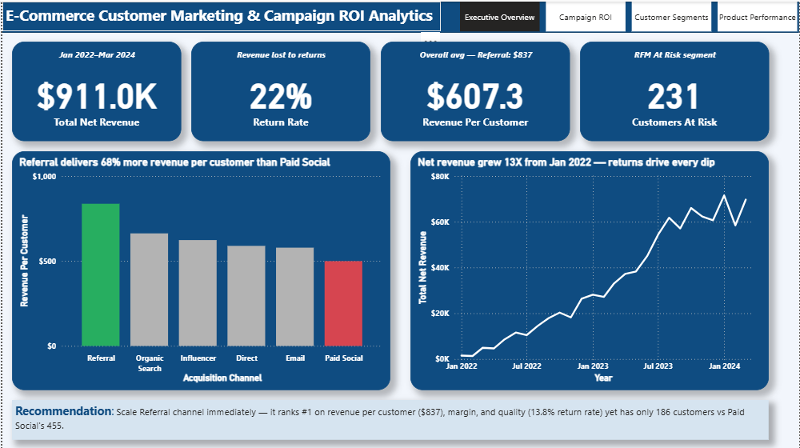

## Project Summary
End-to-end analytics system for a simulated e-commerce fashion 
retailer to measure campaign ROI, identify best-performing 
acquisition channels, segment customers by value, and predict 
Customer Lifetime Value.

**Tools:** SQL · Python (scikit-learn, pandas) · Excel · Power BI  
**Dataset:** 1,500 customers | 8,486 orders | 11,314 campaign events | 200 products  
**Analysis period:** January 2022 – March 2024

---

## The Key Finding — The Referral Paradox

> Referral customers generate **$837 revenue each** — 68% more 
> than Paid Social's $499. Referral ranks #1 on revenue per 
> customer, margin per customer, AND lowest return rate (13.8%).  
> Yet Paid Social receives the largest budget with 455 customers 
> vs Referral's 186.  
> **The best-performing channel is the most underfunded one.**

---

## Project Structure

| Folder | Contents |
|--------|----------|
| `/data` | 6 CSV files — customers, orders, campaigns, products, RFM scores, campaign targets |
| `/sql` | 10 production SQL queries with window functions |
| `/python` | RFM segmentation + CLV prediction model |
| `/outputs` | Dashboard screenshots, Excel report, Python charts |

---

## SQL Analysis — 10 Queries

| Query | New Skill Demonstrated |
|-------|----------------------|
| Q1 — Campaign ROI by type | CASE WHEN + calculated fields |
| Q2 — Revenue per customer by channel | `RANK() OVER` window function |
| Q3 — Month-over-month revenue | `LAG()` window function |
| Q4 — Purchase frequency cohorts | Chained CTEs + `SUM() OVER ()` |
| Q5 — Top products by margin | `RANK() OVER (PARTITION BY)` |
| Q6 — Return rate impact | Multi-table JOIN + aggregation |
| Q7 — Campaign conversion funnel | 4 chained CTEs |
| Q8 — RFM scoring | `NTILE(5)` window function |
| Q9 — First vs repeat purchase | `ROW_NUMBER() OVER (PARTITION BY)` |
| Q10 — Channel attribution | `DENSE_RANK()` across 4 dimensions |

---

## Python Model — RFM Segmentation & CLV Prediction

**RFM Segmentation**
- Scored all 1,500 customers on Recency, Frequency, and Monetary 
  value using NTILE(5) scoring
- Assigned 6 actionable marketing segments

**CLV Prediction — Linear Regression**

| Metric | Score |
|--------|-------|
| R² Score | **0.862** |
| MAE | $103 |
| Meaning | Model explains 86.2% of CLV variance |

**Segment Summary**

| Segment | Customers | Avg Revenue | Action |
|---------|-----------|-------------|--------|
| Champions | 344 | $964 | VIP Rewards + upsell |
| Loyal Customers | 325 | $752 | Personalised retention |
| At Risk | 231 | $669 | Urgent win-back this week |
| Lost Customers | 369 | $273 | Last-chance reactivation |
| New Customers | 131 | $344 | Onboarding series |
| Potential Loyalists | 100 | $346 | Incentivise repeat purchase |

---

## Power BI Dashboard — 4 Pages

### Executive Overview

### Campaign ROI
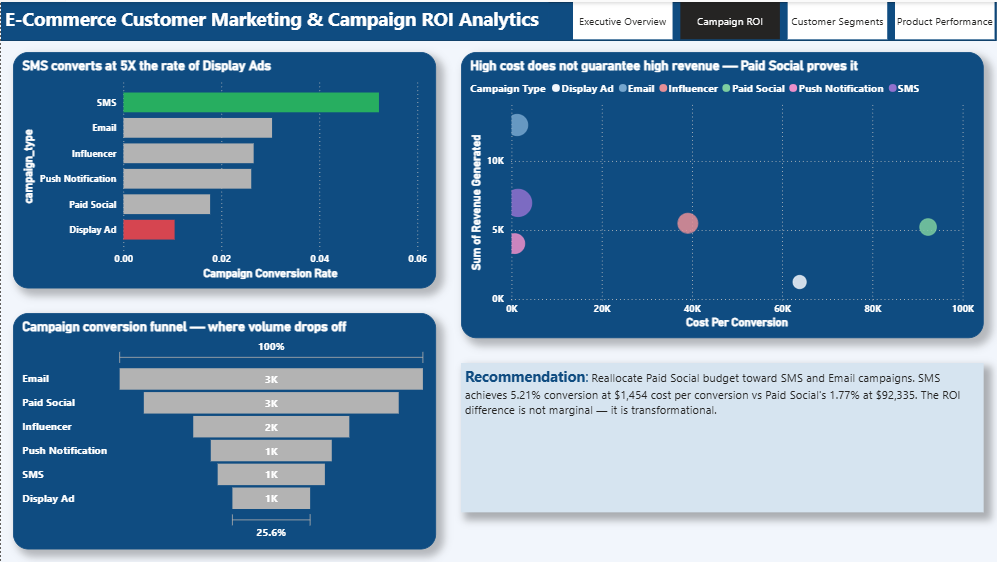

### Customer Segments
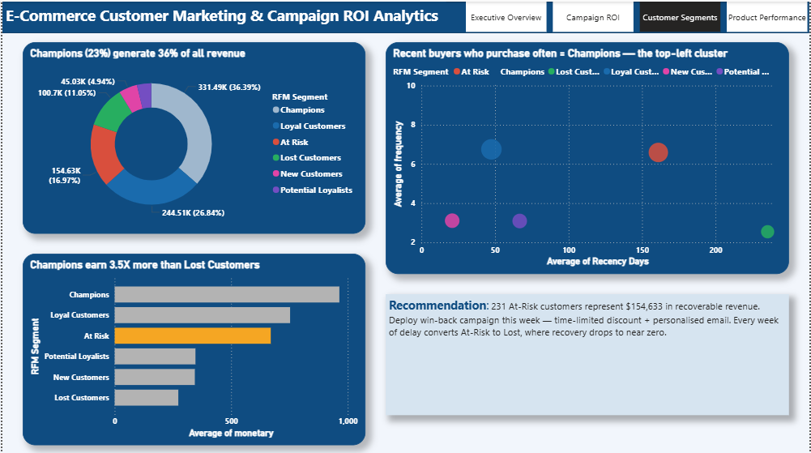

### Product Performance
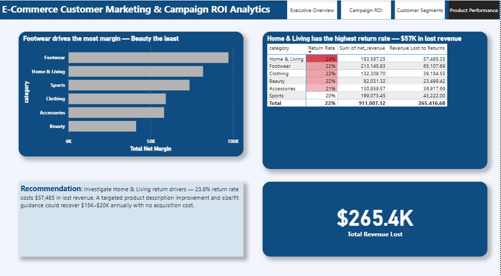

---

## Excel Executive Report — 4 Sheets

### Executive Summary
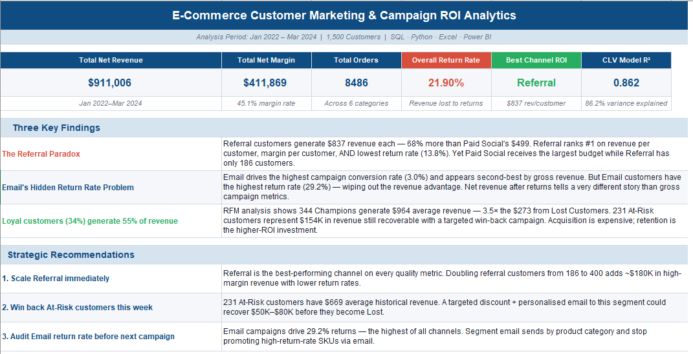

### Revenue Trends
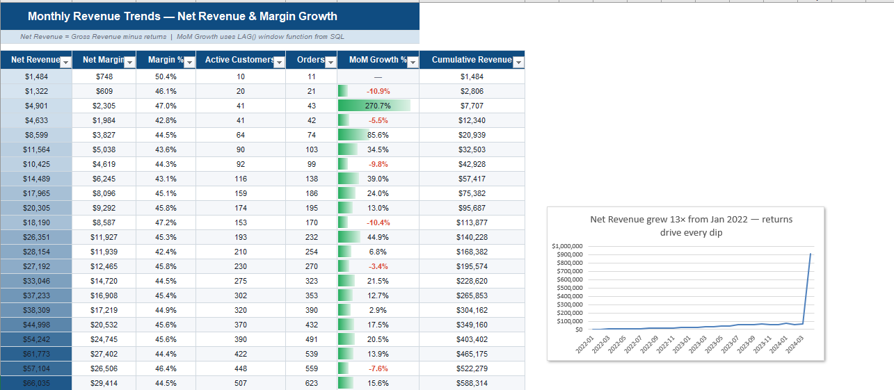

### Campaign & Channel ROI
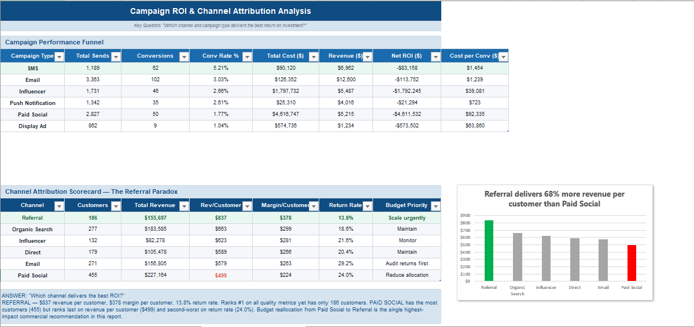

### RFM Customer Segments
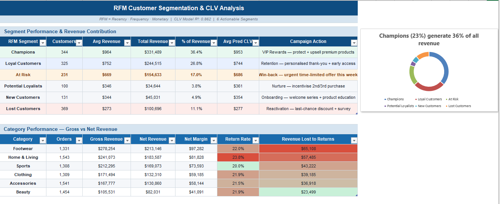

📥 [Download full Excel workbook](outputs/ECommerce_Marketing_ROI_Report.xlsx)

---

## Python Model Visuals

### RFM Segment Distribution
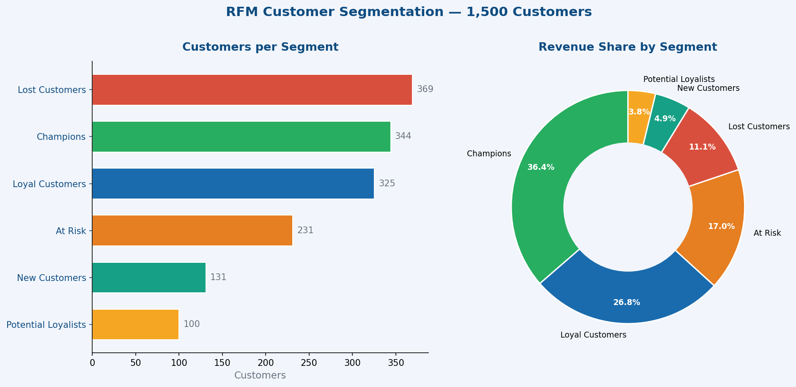

### CLV by Acquisition Channel
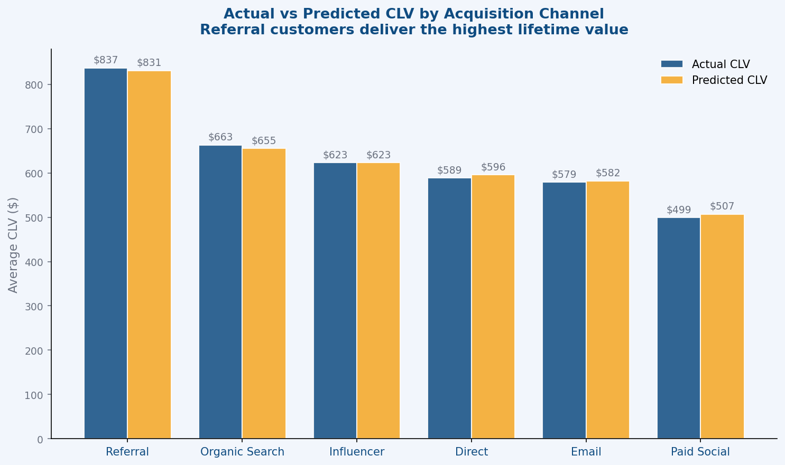

### Channel Attribution Scorecard
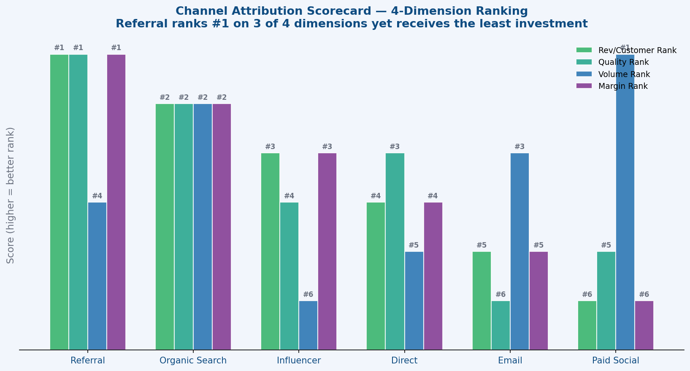

---

## Business Recommendations

1. **Scale Referral immediately** — best channel on every quality 
   metric. Doubling referral customers adds ~$180K high-margin revenue
2. **Win back At-Risk customers this week** — 231 customers, 
   $154K recoverable revenue, time-limited discount campaign
3. **Reallocate Paid Social budget to SMS** — SMS converts at 
   5.21% vs Paid Social 1.77% at 60× lower cost per conversion
4. **Audit Email return rate** — 29.2% returns highest of all 
   channels; stop promoting high-return SKUs via email
5. **Investigate Home & Living returns** — 23.8% return rate 
   costs $57K annually; product description improvement could 
   recover $15–20K with zero acquisition cost

---

## Related Projects

- [SaaS Customer Retention & Churn Intelligence System](https://github.com/Kelvineka/saas-churn-intelligence-system)
